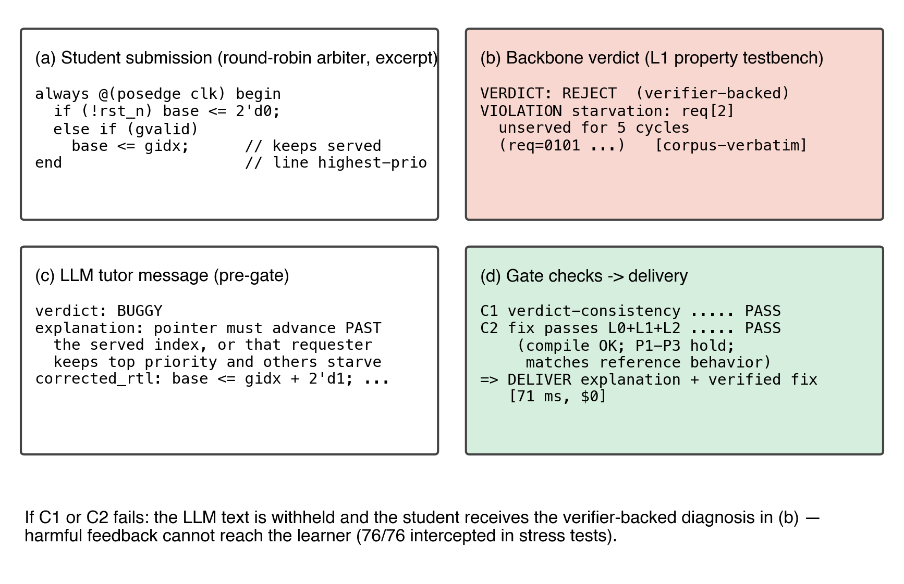

# TrustGrade — Execution-Gated LLM Tutoring for Digital Hardware Design Education

A reference implementation of the framework and system from **"Verify Before You
Teach: An Execution-Gated Framework and System for Trustworthy LLM Tutoring in
Digital Hardware Design Education."**

LLM tutors are fluent but unreliable — and just as confident when wrong as when
right. TrustGrade removes the trust problem architecturally: the LLM is only ever
an *explainer*, and **no correctness-bearing claim reaches a learner unless an
executing check has verified it.** The verifier — not the model, and not a prompt
— carries the guarantee.



## The idea

Four principles turn an unreliable tutor into a safe one:

1. **The LLM is an explainer, never an authority (P1).** Every judgment about
   correctness is decided by executing the code, not by asking a model.
2. **Verified content or verified uncertainty (P2).** What a learner receives is
   either checked-correct or an honest "I can't confirm this."
3. **Validate-or-withhold, never rewrite (P3).** The gate has exactly two
   actions — deliver the tutor's message unchanged, or fall back to the
   verifier's own diagnosis. It never edits the explanation.
4. **Accept the whole solution space (P4).** Assessment tests the *behaviour the
   task requires*, so a structurally different but correct solution is accepted,
   not rejected for disagreeing with a reference.

These are realised by three algorithms, all reducing to one executing backbone:

| Component | Paper | What it does |
|---|---|---|
| **`assess`** (Algorithm 1) | §4.2 | Three-layer verdict: **L0** compile → **L1** property testbench → **L2** differential vs reference; returns `ACC` / `REJ` / `UNC` with a structured diagnosis. |
| **`gate`** (Algorithm 2) | §4.3 | Checks a tutor message `(vₜ, e, f)`: **C1** the tutor's verdict matches the backbone's on the student's code, **C2** the proposed fix itself passes the *full* backbone. Deliver only if both hold. |
| **`validate_scaffold`** (Algorithm 3) | §4.4 | Turns a *plausible* LLM decomposition into a *verified* one: every step compiles and passes its checkpoint, and the final step provably satisfies the assignment contract. |

The **six gating paradigms** compared in the paper (§5.4) — ungated, simulated
student, affordable/frontier LLM review, test-only, and the full execution gate —
are all implemented against one `Reviewer` interface in `trustgrade.arms`, so
they can be run on byte-identical items.

## Repository layout

```
src/trustgrade/
  backbone.py      ASSESS — L0/L1/L2 executing verifier (Algorithm 1)
  gate.py          GATE   — C1 + C2 feedback gate      (Algorithm 2)
  scaffold.py      VALIDATE-SCAFFOLD                    (Algorithm 3)
  diagnosis.py     delta — structured, actionable rejection diagnoses (§4.5)
  arms.py          the six gating-paradigm reviewers    (§5.4)
  stats.py         Wilson CI, exact McNemar, Fisher exact, Cohen's kappa (§5.3)
  llm.py           DeepSeek / frontier client used by the LLM-in-the-loop arms
  prompts.py       Appendix A prompts, verbatim
examples/arbiter/  the paper's running example: reference, a valid alternative,
                   the buggy submission, and the corpus-verbatim property testbench
scripts/demo.py    end-to-end demo (no API keys needed)
tests/             pytest suite (backbone, gate, scaffold, statistics)
prompts/           Appendix A prompts as standalone files
manuscript/        the manuscript (EN + zh), figures embedded
figures/           fig1–fig8, 300 dpi PNG + PDF
docs/              claims audit (evidence table for every literature claim)
```

## Installation

```bash
# 1. Icarus Verilog (the executing backbone drives it)
#    macOS:   brew install icarus-verilog
#    Ubuntu:  sudo apt-get install iverilog
iverilog -V

# 2. Python (3.9+). The backbone/gate/scaffold/stats need only the stdlib.
python -m venv .venv && source .venv/bin/activate
pip install -r requirements.txt        # pytest (tests) + matplotlib (figures)
export PYTHONPATH=src
```

## Quick start

```bash
PYTHONPATH=src python scripts/demo.py
```

```
== Algorithm 1: backbone verdicts (three artifacts from the corpus) ==
  reference.v            -> ACC [L1]  meets Phi (no differential harness)
  alt_token.v (valid alt) -> ACC [L1]  meets Phi (no differential harness)
  buggy_starvation.v     -> REJ [L1]  FAILED: P3 fairness/starvation on line 1 ...

== Algorithm 2: feedback gate on the buggy submission ==
  honest message  -> delivered=True   reason=verified
  harmful message -> delivered=False  reason=C1:verdict-mismatch
                     learner instead receives: FAILED: P3 fairness/starvation ...
```

The harmful tutor message — which validates a starving arbiter as "correct" — is
withheld by construction, and the learner receives the verifier's real diagnosis
instead.

Using it on your own objective:

```python
from trustgrade import Objective, assess, TutorMessage, gate

o = Objective(
    name="my_task", module="my_module",
    reference="path/to/reference.v",
    property_tb="path/to/property_tb.v",   # asserts invariants; prints PASS / FAIL
    harness=None,                          # optional differential harness -> enables L2
    spec="natural-language spec (used by the LLM roles, not the backbone)",
)
a = assess("path/to/student.v", o)         # -> Assessment(verdict, diagnosis, layer)

msg = TutorMessage(verdict="BUGGY", explanation="…", corrected_rtl="path/to/fix.v")
decision = gate(msg, "path/to/student.v", o)   # -> delivered? verified? / fallback
```

The LLM-in-the-loop arms (`arms.SimulatedStudent`, `arms.LLMReview`) take an
`LLMClient`; set `DEEPSEEK_API_KEY` for the affordable reviewer. The execution
gate itself is model-free.

## Reproducibility & provenance

This repository provides the **framework and system**: a runnable implementation
of the published algorithms plus the paper's running example, prompts, figures,
manuscript, and a full evidence audit of every literature claim (`docs/`).

Two honest caveats about the paper's *headline numbers*:

- The evaluation corpus (37 objectives, 221 ground-truth submissions, the
  222-item faulty-feedback corpus) derives from course assignments and is
  governed by the same non-redistribution constraints as any coursework; it is
  released on acceptance per the manuscript's *Data and code availability*
  statement. The arbiter objective is included here in full as a worked example.
- The six-arm comparison numbers come from running the arms in `arms.py` over
  that corpus with frozen LLM verdicts. The **deterministic** arms (`test_only`,
  `full_gate`) and the entire backbone reproduce exactly from this code on any
  Verilog corpus; the **LLM** arms are re-runnable with API keys but, being model
  calls, are not bit-reproducible.

Everything in `src/`, `examples/`, `tests/`, `prompts/`, and `stats.py` is
self-contained and verified end-to-end (`pytest tests/` — 13 tests, requires
Icarus Verilog). See [`docs/PROVENANCE.md`](docs/PROVENANCE.md) for exactly what
is reconstructed-from-the-paper versus corpus-dependent.

## Citation

```bibtex
@article{trustgrade,
  title   = {Verify Before You Teach: An Execution-Gated Framework and System
             for Trustworthy LLM Tutoring in Digital Hardware Design Education},
  year    = {2026},
  note    = {Manuscript; code: https://github.com/cyuanlong/trustgrade}
}
```

## License

MIT — see [LICENSE](LICENSE).
